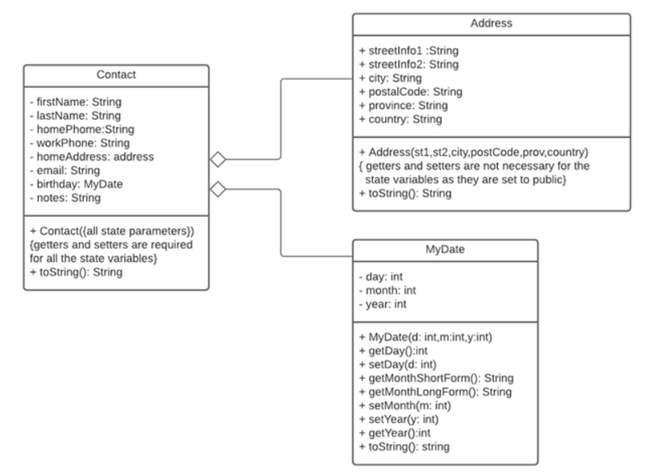

# Go2ItBootCamp_Week4
Solutions to the tasks of Go2IT Boot Camp - Week 4 

# Movie DB Task Desription: 
At a particular film festival, 'm' movies are to be reviewed by 'r' reviewers. Each movie and reviewer is assigned a number starting from 0. The reviewers rate each movie on an integer scale from 1 to 10 inclusive. You must write a program that:  
- Requests the number of reviewers (r) and movies (m);
- Reads all the ratings for each movie by each reviewer;
- Calculates and prints the average rating for each movie;
- Calculates and prints the average reviewer rating for each reviewer;

# Dog Shelter Task Description: 
A dog shelter is a simple system to keep track of all the dogs that pass through the facility. The system must record for each dog:
- id (int) - must be unique
- name (string)
- age (double) - cannot be less than 0 or more than 25
- breed (string)
- sex (char) – m for male, f for female
- hasFoundHome (bool) - true means the dog has been placed in a home, false otherwise
You must create a true OOP-style solution with a text based menu as summarized below. The system must check that a valid option is entered. For example, the menu has 4 items so only 1 to 5 must be allowed as input from the menu.
System Menu:
1. Add dog
2. View all dogs
3. View all available dogs
4. View dog
5. Update dog  home status
6. Exit
Overview:
- Add Dog: When a dog is added to the system, you must check that the id is not already used in the system. All new dogs have no home as yet (hasFoundHome = false).
- View all Dogs: This menu option shows all dogs in the system. This includes dogs that have a home and those that do not.
- View all available dogs: Shows all dogs in the system, that have no homes yet.
- View dog: Asks the user for a id of the dog and then displays the dog information, if found, and “There is no dog with that id..” if it is not found.
- Update dog home status: Asks the user for an id. If a dog with that id is found, the “hasFoundHome” status is changed to true and the dog information is to be displayed. If the dog is not found, the message “There is no dog with that id..”  should be displayed.

# Address Book Task 

Create an application that will serve users with Address Book features.
The program should allow the user to:
- add, 
- edit and 
- delete contacts. 
The following class diagram (UML) shows the classes that are required to store information for each contact:

